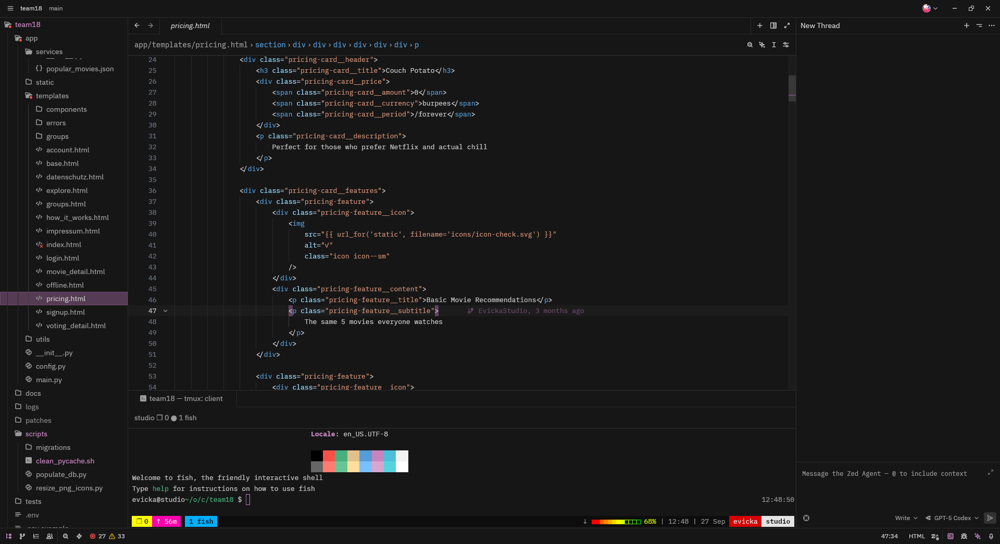

# Kestral Theme

One of the default themes from Microsoft's Visual Studio Code ported over to Zed.

- <https://github.com/microsoft/vscode/blob/main/extensions/theme-defaults/themes/dark_modern.json>

Forked from <https://github.com/kcamcam/vscode-dark-modern-theme> and applied my own vscode dark modern based theme called Kestral to it.

- <https://github.com/EvickaStudio/kestral-theme>

