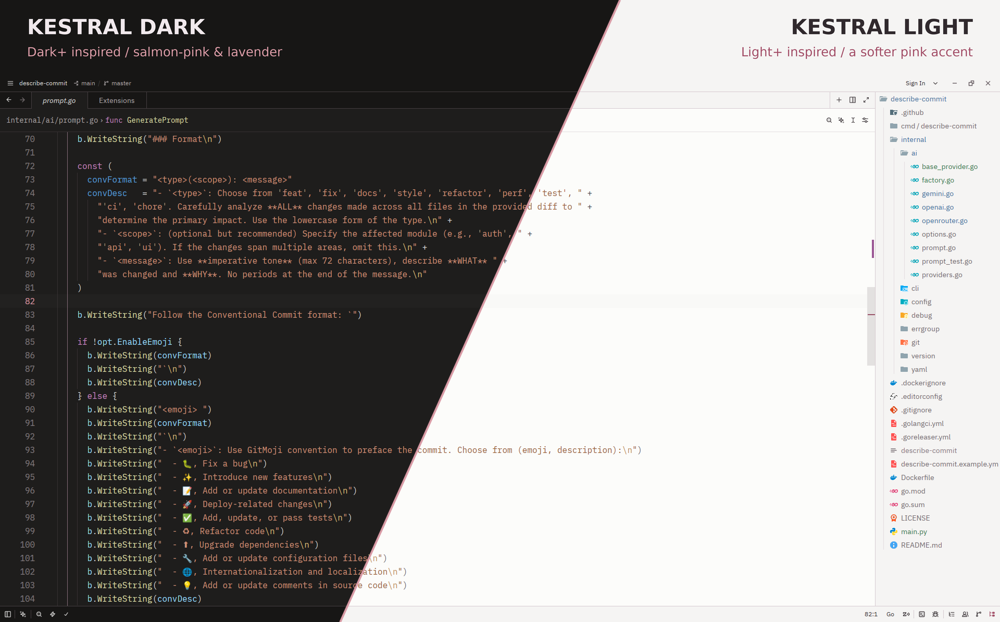

# Kestral Theme

The [Kestral VS Code theme](https://github.com/EvickaStudio/kestral-theme), adapted for Zed.

- **Kestral Dark:** warm neutral backgrounds, salmon-pink accents, and lavender highlights.
- **Kestral Light:** off-white backgrounds, deeper salmon accents, and lavender highlights.

## v0.0.4

Both variants follow the upstream Kestral v0.0.4 UI palette, including editor selections, search matches, menus, scrollbars, Git decorations, and diagnostics. The existing Dark+/Light+-inspired Zed syntax mappings and terminal ANSI colors are preserved, matching the upstream release's focus on UI colors.

Zed uses different UI roles and syntax captures than VS Code, so this is a native adaptation rather than a pixel-identical port.

## Try locally

Copy both JSON files from `themes/` into `~/.config/zed/themes/` on Linux or macOS, then restart Zed. Open **theme selector: toggle** from the command palette and choose **Kestral Dark** or **Kestral Light**. See [Zed's local theme documentation](https://zed.dev/docs/themes#local-themes) for other platforms.

For automatic light/dark switching, add this to your Zed settings:

```json
{
  "theme": {
    "mode": "system",
    "light": "Kestral Light",
    "dark": "Kestral Dark"
  }
}
```

## Credits

Originally forked from [vscode-dark-modern-theme](https://github.com/kcamcam/vscode-dark-modern-theme), with Kestral's custom palette based on Microsoft's VS Code themes.

## Preview

Kestral v0.0.4 in Zed, shown with the same file and editor layout in both variants.



[View Kestral Dark](assets/kestral-dark.webp) · [View Kestral Light](assets/kestral-light.webp)

All previews are full-resolution, lossless WebP images.
